# AWS-SSO

## ArgoCD integration with AWS SSO:

There is way to integrate Argo CD with AWS SSO users. Generally service initiated flow of argocd works with aws sso.
With AWS SSO in place one can have centralized view of applications in a single pane of glass

```Pre-requisites
 * Requires an AWS account
 * Requires ArgoCD setup
```


* [Service-initiated flow]
  Service-initiated flow and Identity Provider (IdP)-initiated flow are terms commonly used in the context of Single Sign-On (SSO) and authentication processes. They refer to different approaches for initiating the authentication process when a user wants to access a protected resource.

* [Service-Initiated Flow] In a service-initiated flow, the     
 authentication process is initiated by the service or application that the user is trying to access. Here's how the flow typically works:
  •	The user navigates to a service or application.
  •	The service recognizes that the user needs to be authenticated before accessing the resource.
  •	The service redirects the user to an Identity Provider (IdP) or an authentication page.
  •	The user authenticates with the IdP.
  •	The IdP generates an authentication token (e.g., SAML assertion, JWT).
  •	The IdP redirects the user back to the service with the authentication token.
  •	The service validates the token and grants the user access to the requested resource.
Note: ArgoCd works based on the service-initiated flow.


* [Steps to create custom application in AWS SSO IAM Identity Center]
 1.	Navigate to the IAM Identity Center > choose applications under the application assignment.
     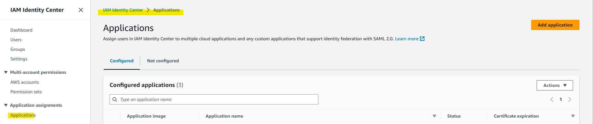

 2.	Create the application and choose the add custom SAML 2.0 application. As there is no preintegrated application for the ArgoCD
     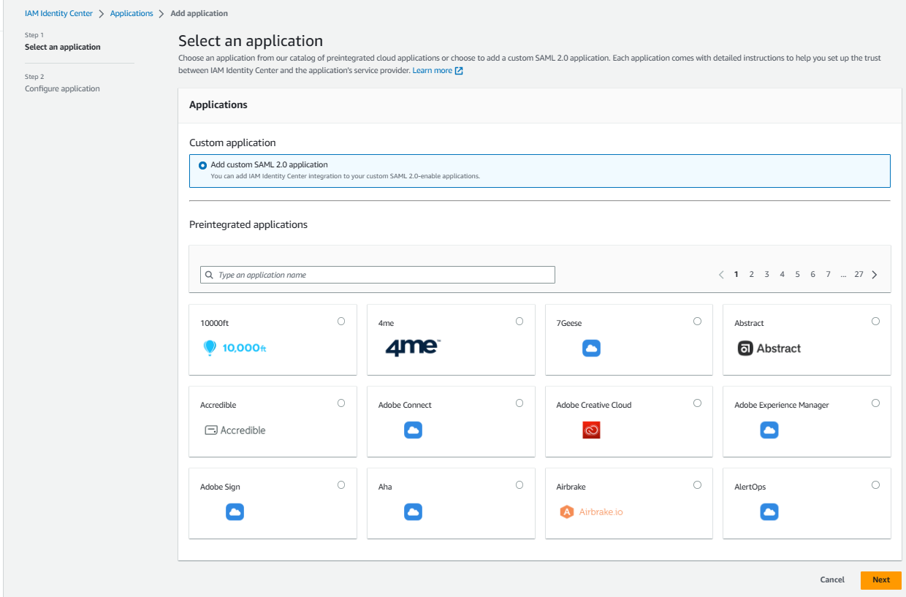

 Configure Application:
  Provide the display name and Description.
  IAM identity Center metadata
  •	Download the IAM identity center certificate later it is required to configure in the Argocd config map.
  •	Copy the IAM Identity Center sign-in URL
  •	Copy IAM Identity Center SAML issuer URL
    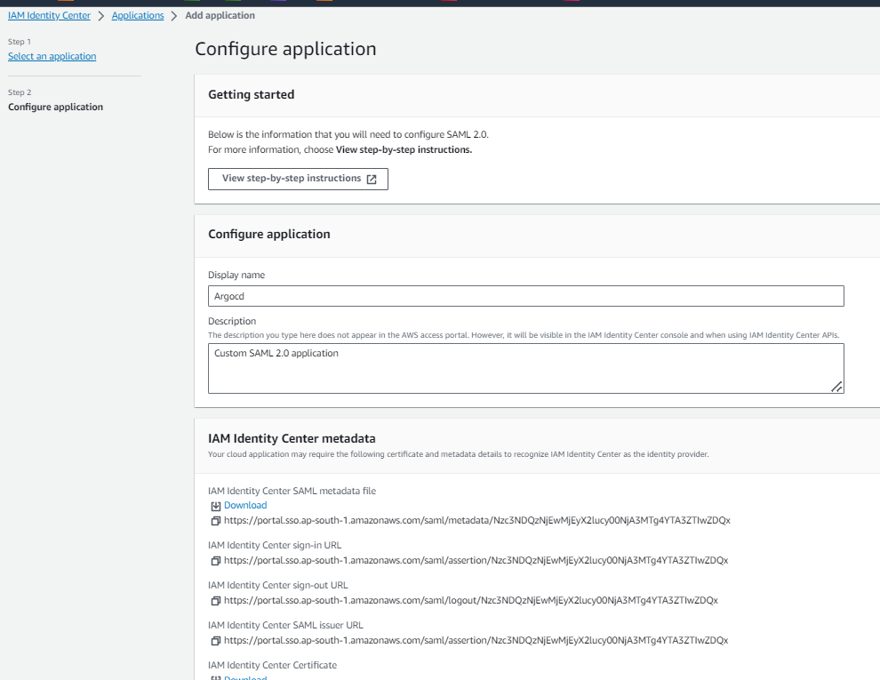

 3.	As the application properties is optional skip that filed and configure the application metadata and submit.
  •	Provide the Application ACS URL and Application SAML audience.
    Example: https://<argocd  URL>/api/dex/callback.
  •	Click on Submit.

     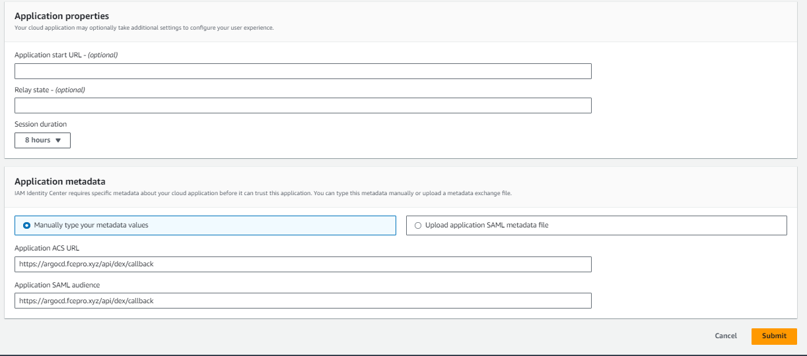
 4.	Create the group and add the user to the group.

     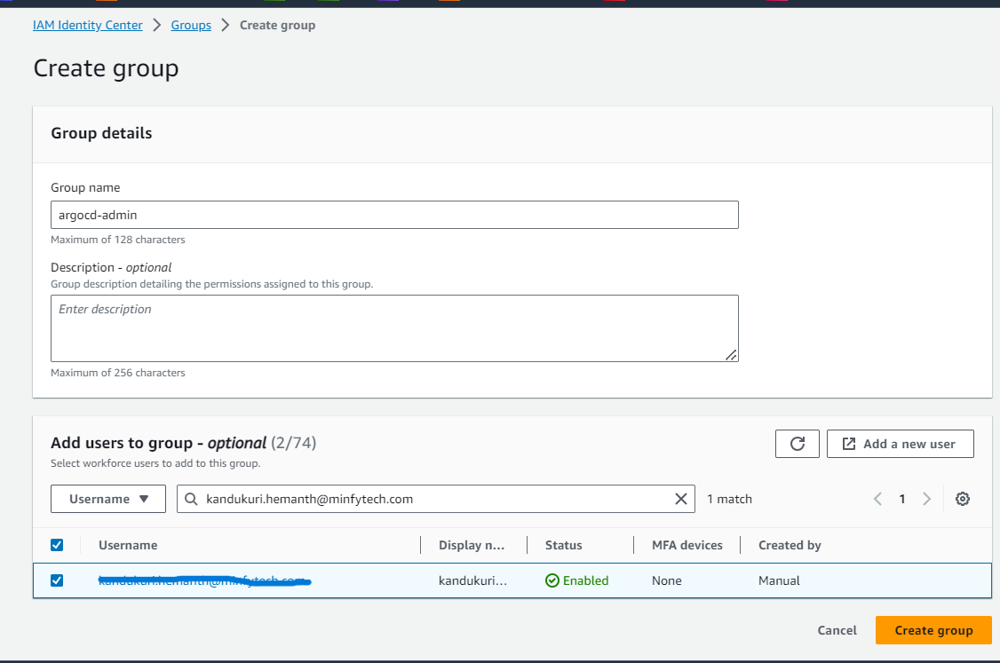

 5.	Click on the application that is created in the 3rd step. Assign the group(created in 4th step) to the application by click on the Assign user.

  •	Select the group argocd-admin
  •	Click on the assign the user
      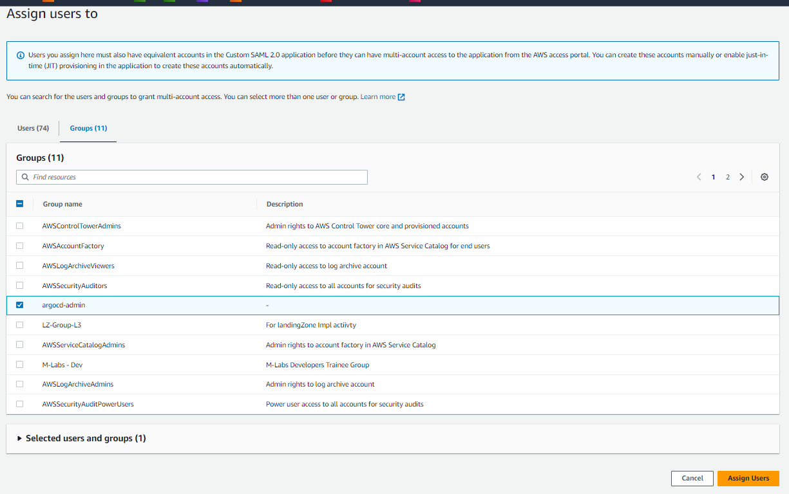

  •	Group is assigned to application
       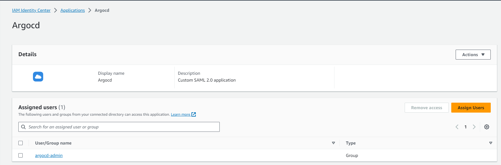 
 6.	Go to application and Click on the attribute mappings.
 7.	Edit the attribute mappings values and save the changes.
  •	${user:subject}   Persistent
  •	${user:groups}    Unspecified
  •	${user:email}     Unspecified
       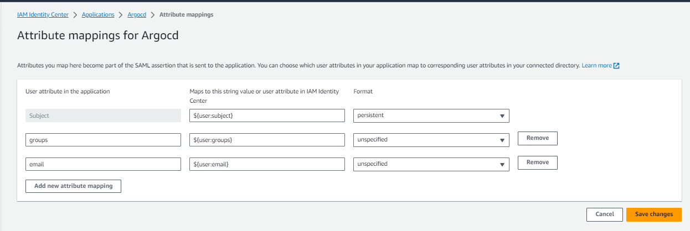


* Once you've set up one of the above integrations, be sure to edit `argo-rbac-cm` to configure permissions (as in the example below). See [RBAC Configurations](../rbac.md) for more detailed scenarios.

```yaml
apiVersion: v1
kind: ConfigMap
metadata:
  name: argocd-rbac-cm
  namespace: argocd
data:
  policy.csv: |
    p, role:readonly, applications, get, */*, allow
    p, role:readonly, certificates, get, *, allow
    p, role:readonly, clusters, get, *, allow
    p, role:readonly, repositories, get, *, allow
    p, role:readonly, projects, get, *, allow
    p, role:readonly, accounts, get, *, allow
    p, role:readonly, gpgkeys, get, *, allow
    p, role:admin, applications, create, */*, allow
    p, role:admin, applications, update, */*, allow
    p, role:admin, applications, delete, */*, allow
    p, role:admin, applications, sync, */*, allow
    p, role:admin, applications, override, */*, allow
    p, role:admin, applications, action/*, */*, allow
    p, role:admin, certificates, create, *, allow
    p, role:admin, certificates, update, *, allow
    p, role:admin, certificates, delete, *, allow
    p, role:admin, clusters, create, *, allow
    p, role:admin, clusters, update, *, allow
    p, role:admin, clusters, delete, *, allow
    p, role:admin, repositories, create, *, allow
    p, role:admin, repositories, update, *, allow
    p, role:admin, repositories, delete, *, allow
    p, role:admin, projects, create, *, allow
    p, role:admin, projects, update, *, allow
    p, role:admin, projects, delete, *, allow
    p, role:admin, accounts, update, *, allow
    p, role:admin, gpgkeys, create, *, allow
    p, role:admin, gpgkeys, delete, *, allow

    g, <groupID>, role:readonly
    g, <groupID>, role:admin
    #policy.default: role:readonly
  scopes: '[ groups, email]'
```
  8.	Steps to configure the details in ArgoCD configmap:
  •	Below is the configuration template need to be update in the argocd-cm.
  •	Provide the below details which is copied in the previous step.
  •	SSO URL: provide the SSO URL as the IAM Identity Center sign-in URL
  •	caData: Provide the IAM identity center certificate in Base6 encoded format.
  •	entityIssuer: https://<argocd-url>/api/dex/callback
  •	redirectURI: https://<argocd-url>/api/dex/callback


```yaml
apiVersion: v1
kind: ConfigMap
metadata:
  name: argocd-cm
  namespace: argocd
data:
  url: https://<argocd-url>
  dex.config: |
    logger:
      level: debug
      format: json
    connectors:
    - type: saml
      id: saml
      name: saml
      config:
        entityIssuer: https://<argocd-url>/api/dex/callback
        ssoURL: saml sign-in url from sso 
        caData: |
        BASE64 ENCODED CRT
        redirectURI: https://<argocd-url>/api/dex/callback
        usernameAttr: email
        emailAttr: email
        groupsAttr: Group
```
Once edited, restart the argocd-server deployment to pick up the config changes.
```
 kubectl rollout restart deploy argocd-server -n argocd
```
9.	Login to the Argocd domain URL and Click on the Log In Via AWSSO

       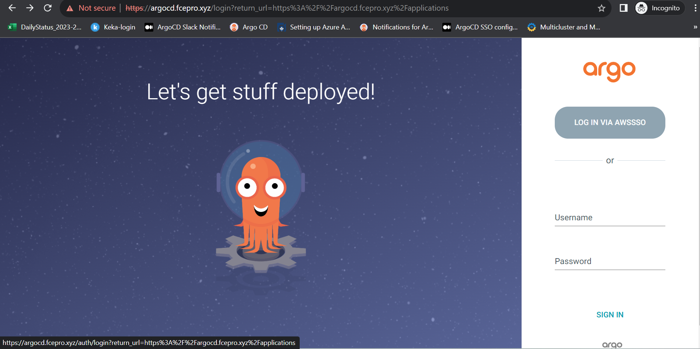

10. you will be Redirected to the AWS SSO to enter the Username and password.

       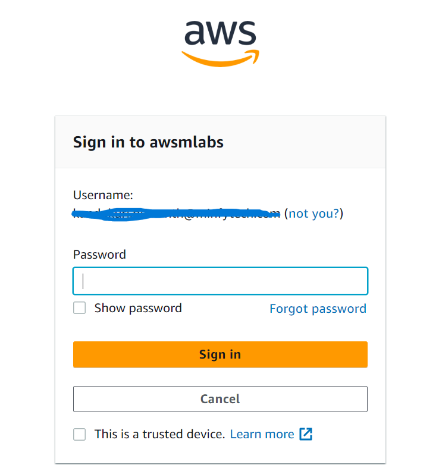

11. Post validating the credentials user will be able to access the ArgoCD application.

       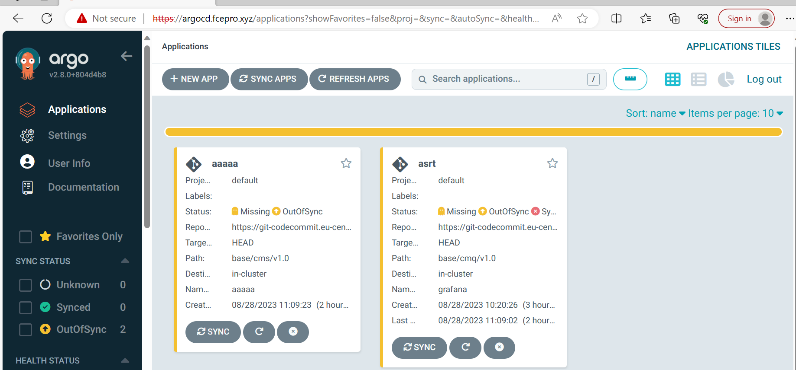

### References

- [Encode certificate using base64 encode](https://www.base64encode.org/)

•	Browse the URL: https://www.base64encode.org/
•	Provide certificate data which is downloaded in the above step and click on ENCODE
•	Copy the encoded certificate data to the argocd-cm file.
       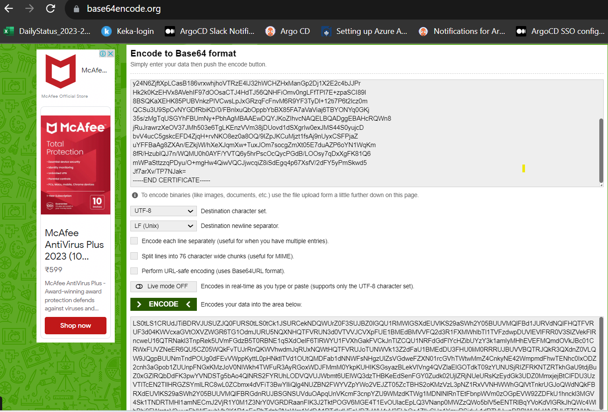

11. To remove the Argocd admin login in Argocd application update the Argocd-cm configmap and set it to false.
•	admin.enabled: “false”
     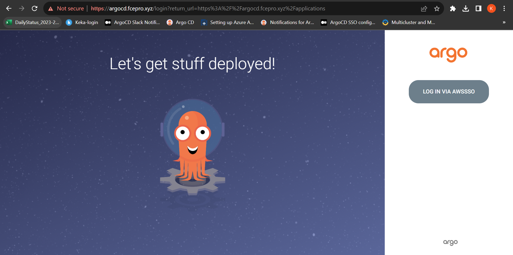